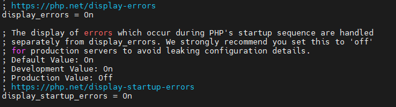
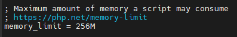
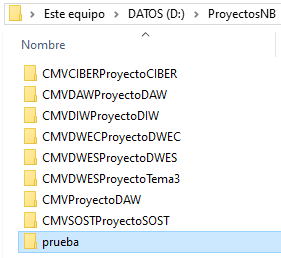
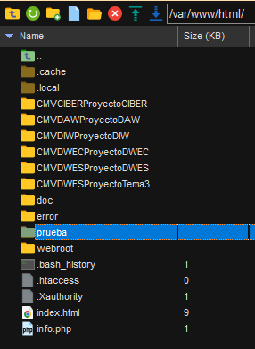
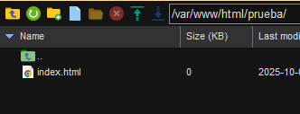
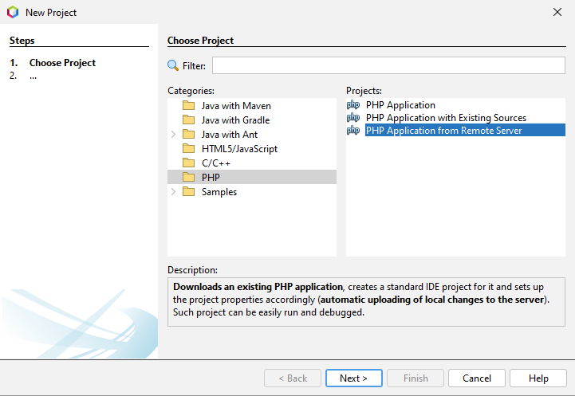
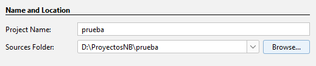
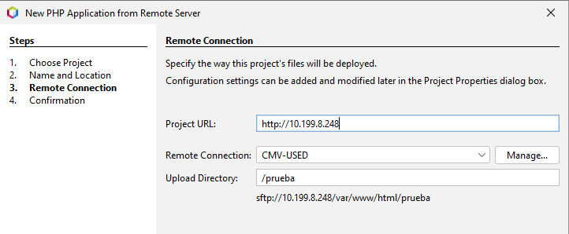
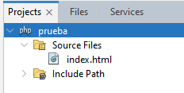

# CFGS Desarrollo de Aplicaciones Web

|  CFGS DESARROLLO  DE APLICACIONES WEB |
|:-----------:|
||
| DESPLIEGUE DE APLICACIONES WEB
| CIBERSEGURIDAD
| DWES Tema 2. INSTALACIÓN, CONFIGURACIÓN Y DOCUMENTACIÓN DE ENTORNO DE DESARROLLO Y DEL ENTORNO DE EXPLOTACIÓN |


- [CFGS Desarrollo de Aplicaciones Web](#cfgs-desarrollo-de-aplicaciones-web)
  - [1. Entorno de Desarrollo](#1-entorno-de-desarrollo)
    - [1.1 Ubuntu Server 24.04.3 LTS](#11-ubuntu-server-24043-lts)
      - [1.1.1 **Configuración inicial**](#111-configuración-inicial)
        - [Nombre y configuraicón de red](#nombre-y-configuraicón-de-red)
        - [**Actualizar el sistema**](#actualizar-el-sistema)
        - [**Configuración fecha y hora**](#configuración-fecha-y-hora)
        - [**Cuentas administradoras**](#cuentas-administradoras)
        - [**Habilitar cortafuegos**](#habilitar-cortafuegos)
      - [1.1.2 Instalación del servidor web](#112-instalación-del-servidor-web)
        - [Instalación](#instalación)
        - [Verficación del servicio](#verficación-del-servicio)
        - [Virtual Hosts](#virtual-hosts)
        - [Permisos y usuarios](#permisos-y-usuarios)
      - [1.1.3 PHP](#113-php)
        - [**Proceso para instalar y configurar PHP 8.3 como servicio FPM (FastCGI Process Manager) en un servidor Apache sobre Ubuntu**](#proceso-para-instalar-y-configurar-php-83-como-servicio-fpm-fastcgi-process-manager-en-un-servidor-apache-sobre-ubuntu)
      - [1.1.4 MySQL](#114-mysql)
      - [1.1.5 XDebug](#115-xdebug)
      - [1.1.6 Servidor web seguro (HTTPS)](#116-servidor-web-seguro-https)
      - [1.1.7 DNS](#117-dns)
      - [1.1.8 SFTP](#118-sftp)
      - [1.1.9 Apache Tomcat](#119-apache-tomcat)
      - [1.1.10 LDAP](#1110-ldap)
    - [1.2 Windows 11](#12-windows-11)
      - [1.2.1 **Configuración inicial**](#121-configuración-inicial)
        - [**Nombre y configuración de red**](#nombre-y-configuración-de-red)
        - [**Cuentas administradoras**](#cuentas-administradoras-1)
      - [1.2.2 **Navegadores**](#122-navegadores)
      - [1.2.3 **MobaXTerm**](#123-mobaxterm)
      - [1.2.4 **Netbeans**](#124-netbeans)
        - [**Crear Proyecto**](#crear-proyecto)
        - [**Eliminar Proyecto**](#eliminar-proyecto)
      - [1.2.5 **Visual Studio Code**](#125-visual-studio-code)
  - [2. GitHub](#2-github)
  - [3.Entorno de Explotación](#3entorno-de-explotación)

## 1. Entorno de Desarrollo

### 1.1 Ubuntu Server 24.04.3 LTS

Este documento es una guía detallada del proceso de instalación y configuración de un servidor de aplicaciones en Ubuntu Server utilizando Apache, con soporte PHP y MySQL

```bash
#Para ver version del sistema:
uname -a
```

#### 1.1.1 **Configuración inicial**

##### Nombre y configuraicón de red

> **Nombre de la máquina**: CMV-USLimpia\
```bash
#Se ve con: 
hostname

#Se cambia con:
1. sudo hostnamectl set-hostname "nombre"
2. sudo nano /etc/hosts y cambiando la linea donde pone 127.0.1.1

```
> **Memoria RAM**: 2G\
> **Particiones**: 150G(/) y resto (/var)\
```bash
#Se ve con:
df -h
```
> **Configuración de red interface**: enp0s3\
> **Dirección IP** :10.199.8.248/22\
> **GW**: 10.199.8.1/22\
> **DNS**: 10.151.123.21 y 10.151.126.21
```bash
#Se ve con:
ip a (RED)
ip r (GW)
resolvectl (DNS)

#Se cambia entrando en:
sudo nano /etc/netplan/enp0s3.yaml
(Ver más abajo)
```

Editar el fichero de configuración del interface de red  **/etc/netplan**,
```bash
#CONFIGURACION DINAMICA
network:
  version: 2
  ethernets:
    enp0s3:
      dhcp4: true
````

```bash
#CONFIGURACION ESTATICA
network:
  ethernets:
    enp0s3:
      addresses:
       - 10.199.8.248/22
      nameservers:
         addresses:
         - 10.151.123.21
         - 10.151.126.21
         search: [educa.jcyl.es]
      routes:
        - to: default
          via: 10.199.8.1
  version: 2
````

##### **Actualizar el sistema**

```bash
sudo apt update
sudo apt upgrade
```

##### **Configuración fecha y hora**

[Establecer fecha, hora y zona horaria](https://somebooks.es/establecer-la-fecha-hora-y-zona-horaria-en-la-terminal-de-ubuntu-20-04-lts/ "Cambiar fecha y hora")


##### **Cuentas administradoras**

> - [X] root(inicio)
> - [X] miadmin/paso
> - [X] miadmin2/paso

```bash
#Los usuarios se ven en:
sudo cat /etc/passwd [|grep "nombre de usuario para filtrar"]

#Para ver los usuarios por grupo:
sudo cat /etc/group
```
##### **Habilitar cortafuegos**
```bash
#Para encender cortafuegos:
sudo ufw start

#Para habilitar puertos:
sudo ufw allow 22

#Para ver estado y puertos activos:
sudo ufw status [numbered]

#Para eliminar algún puerto
sudo ufw delete "nº de puerto (ver con numbered)"
``` 
#### 1.1.2 Instalación del servidor web

##### Instalación
```bash
sudo apt install apache2
sudo ufw allow 80
```
##### Verficación del servicio
```bash
sudo service apache2 status
sudo systemctl status apache2
```
##### Virtual Hosts
##### Permisos y usuarios
```bash
#Para crear el usuario y asignarle una contraseña
sudo useradd -M -d /var/www/html -s /bin/bash -g www-data operadorweb
sudo passwd operadorweb

#Para comprobar que se ha creado bien:
cat /etc/passwd | grep operadorweb

#Cambiar propietario de grupo:
sudo chown -R operadorweb:www-data /var/www/html

#Cambiar permisos de la carpeta:
sudo chmod -R 775 /var/www/html
```

#### 1.1.3 PHP
##### **Proceso para instalar y configurar PHP 8.3 como servicio FPM (FastCGI Process Manager) en un servidor Apache sobre Ubuntu**
```bash
#Instala herramientas para administrar los repositorios de software, como add-apt-repository
sudo apt install software-properties-common -y
 
#Añade un repositorio que proporciona versiones actualizadas de PHP (incluyendo 8.3).
sudo add-apt-repository ppa:ondrej/php -y

#Muestra los archivos de configuración de los repositorios y filtra los que contienen "ondrej". Sirve como verificación de que el repositorio se agregó correctamente
ls /etc/apt/sources.list.d/ | grep ondrej
 
#Actualiza la base de datos local de paquetes con la nueva información del repositorio ondrej/php.
sudo apt update
 
#Instala: 
#libapache2-mod-php8.3: módulo clásico de PHP para Apache. (OPCIONAL, mejor no instalarlo para evitar conflictos)
#php8.3-fpm: versión de PHP como servicio FPM (mejor para rendimiento y aislamiento).
sudo apt install libapache2-mod-php8.3 php8.3-fpm -y
 
#Desactiva mod_php, el método tradicional en que Apache ejecuta PHP. Esto es necesario para evitar conflictos con FPM.
sudo a2dismod php8.3
 
#mpm_prefork es el módulo de procesamiento que se usa con mod_php. Incompatible con proxy_fcgi, por eso se desactiva.
sudo a2dismod mpm_prefork
 
#mpm_event: MPM más moderno y eficiente, compatible con php-fpm. proxy_fcgi: Asegura que Apache pueda comunicarse con PHP-FPM.
sudo a2enmod mpm_event proxy_fcgi
 
#Activa el archivo de configuración que conecta Apache con el servicio php8.3-fpm.
sudo a2enconf php8.3-fpm
 
#Reinicia Apache para que los cambios surtan efecto.
sudo systemctl restart apache2
```
En **/etc/php/8.3/apache2/php.ini** y **/etc/php/8.3/fpm/php.ini**

- Cambiar **display_errors** a "On"
- Cambiar **display_startup_errors** a "On"


- Cambiar **memory_limit** a "256M"



#### 1.1.4 MySQL
#### 1.1.5 XDebug
#### 1.1.6 Servidor web seguro (HTTPS)
#### 1.1.7 DNS
#### 1.1.8 SFTP
#### 1.1.9 Apache Tomcat
#### 1.1.10 LDAP

### 1.2 Windows 11
#### 1.2.1 **Configuración inicial**
##### **Nombre y configuración de red**
##### **Cuentas administradoras**
#### 1.2.2 **Navegadores**
#### 1.2.3 **MobaXTerm**

#### 1.2.4 **Netbeans**
##### **Crear Proyecto**
1. En nuestro almacenamiento local, es decir, la maquina anfitriona (en mi caso Windows 10) creamos una carpeta para guardar nuestro proyecto\

2. En nuestro almacenamiento remoto, es decir, nuestro servidor web en una máquina virtual de Ubuntu Server version 24.04.3 crearemos tambien un directorio en /var/www/html con el nombre del proyecto y dentro un index\
\

3. Ahora en Netbeans creamos el proyecto eligiendo el almacenamiento remoto de donde cogerá los archivos para empezar (el directorio con el index que creamos antes)
   1. Arriba a la izquierda damos a crear proyecto y luego elegimos PHP y la tercera opción\

   2. Ahora pondremos el nombre del proyecto y su ubicacion (la carpeta local de antes)\

   3. Ahora ponemos la url del servidor y el directorio de donde se cargaran los archivos (el index de antes)\

   4. Despues de dar varias veces a siguiente ya nos aparecerá el proyecto creado a la izquierda y tendremos el index creado en el servidor accesible desde el IDE\

##### **Eliminar Proyecto**
1. Para eliminar un proyecto haremos clic derecho sobre el proyecto que queremos eliminar y ahí le daremos a "Delete".\

2. Se nos abrirá una ventana de confirmación que tendrá una opción para marcar por si queremos eliminar tambien la carpeta y los archivos del proyecto,elegimos esa opcion si queremos.\

1. Ahora en nuestro almacenamiento local, donde creamos el proyecto, ya no nos aparecerá, ya que se ha eliminado.
2. Pero aún conservaremos la carpeta y los archivos en remoto, los cuales si queremos podemos reutilizar para volver a crear un proyecto con ellos, o eliminarlos tambien.

#### 1.2.5 **Visual Studio Code**
## 2. GitHub
## 3.Entorno de Explotación

---

> **Cristian Mateos Vega**  
> Curso: 2025/2026  
> 2º Curso CFGS Desarrollo de Aplicaciones Web  

